# 1_Week
### 1_Assignment (instagramSopt)

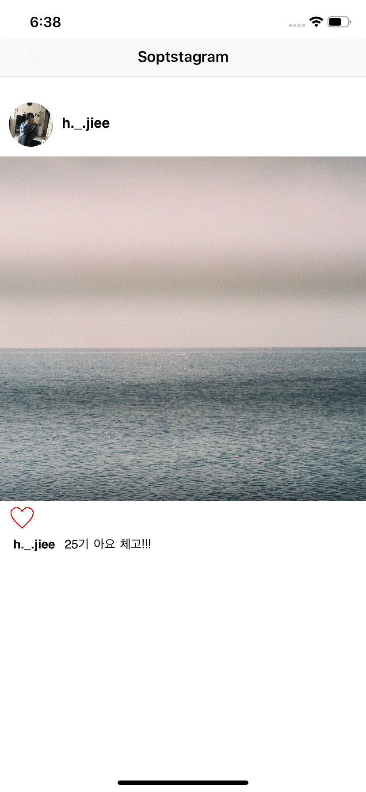</img>

- Profile Round Image

  ```swift
  // 프로필 이미지 뷰
  @IBOutlet var imgSopt: UIImageView!
  
  // 프로필 이미지 둥글게 만들기
  imgSopt.layer.cornerRadius = 50/2
  ```

- Like Button Action

  ```swift
  // 버튼 동작을 위한 IBOutlet (하트 버튼)
  @IBOutlet var likeBtn: UIButton!
  
  // 버튼 클릭시 나타날 레이블
  @IBOutlet var text: UILabel!
  
  // 하트 버튼 눌렀을 때 동작하는 IBAction
  @IBAction func onClick(_ sender: Any) {
    if(check){
      self.text.text = "h._.jiee 님이 좋아합니다."
      self.likeBtn.setImage(afterBtn, for: .normal)
      check = false
    }
    else {
      self.text.text = ""
      self.likeBtn.setImage(beforeBtn, for: .normal)
      check = true
    }
  }
  ```

# 1_Advanced
### Switch-Image Action (switchCandle)

- Switch on/off - Image change

  ```swift
  class CandleVC: UIViewController {
  
      @IBOutlet var candleImg: UIImageView!
      @IBOutlet var candleText: UILabel!
      
        // 상수에 이미지 지정
      let onImg = UIImage(named: "candle-on.jpg")
      let offImg = UIImage(named: "candle-off.jpg")
      
      override func viewDidLoad() {
          super.viewDidLoad()
      }
      
        // sender를 Any가 아닌 UISwitch로 선언
      @IBAction func candleAction(_ sender: UISwitch) {
        
          // 스위치 on
          if sender.isOn {
              candleText.text = "On"
              candleImg.image = onImg
          }
        
          // 스위치 off
          else {
              candleText.text = "Off"
              candleImg.image = offImg
          }
        
      }
  ```

### Background Color Change (changeBackground)
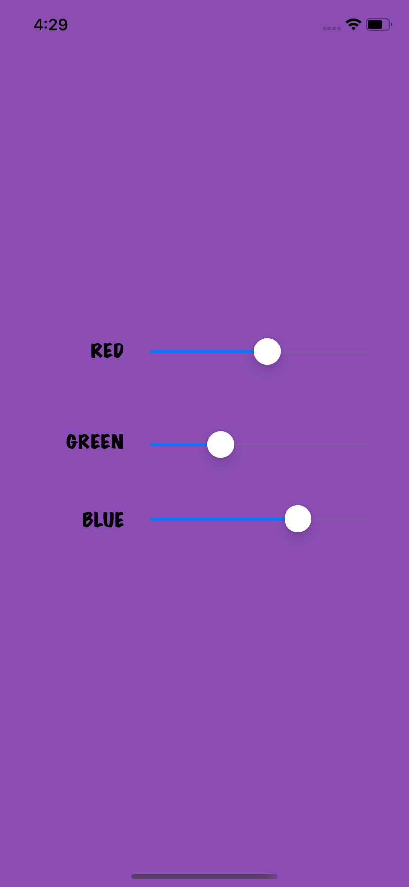</img>

- User Slider

  ```swift
          // 슬라이더 세개 IBOutlet 선언
          @IBOutlet var sliderRed: UISlider!
      @IBOutlet var sliderGreen: UISlider!
      @IBOutlet var sliderBlue: UISlider!
  
          // IBAction의 sender를 UISlider로 선언
      @IBAction func updateColor(_ sender: UISlider) {
        
          // 슬라이더 값을 받아와 view의 배경색 변경
          self.view.backgroundColor =
          UIColor.init(red:CGFloat(self.sliderRed.value),
          green: CGFloat(self.sliderGreen.value),
          blue: CGFloat(self.sliderBlue.value), alpha: 1.0)
        
      }
  ```
  
  ### Segment Control (segmentControl)
  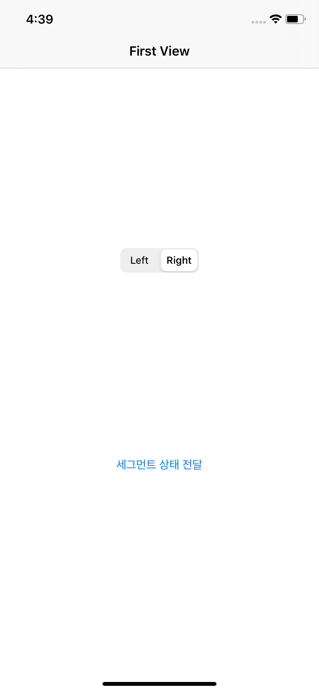</img>
  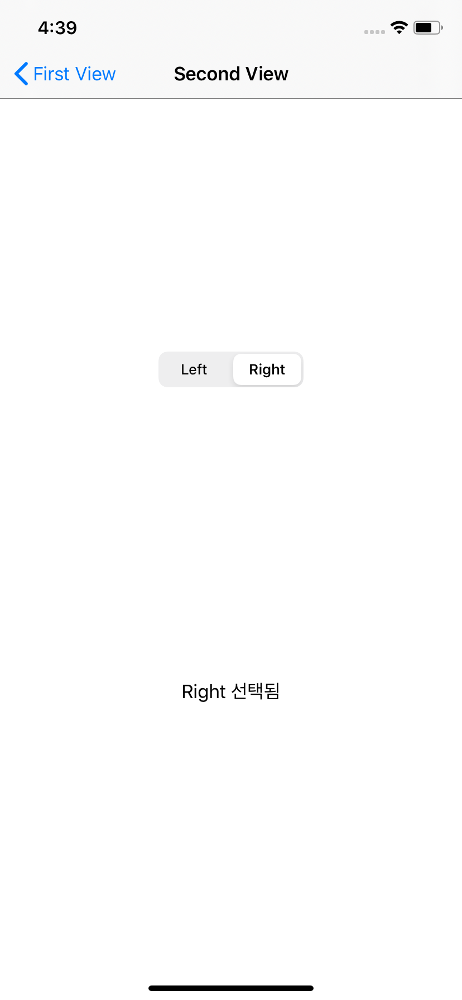</img>

  - First View

    ```swift
          // 세그먼트 IBOutlet
        @IBOutlet var leftRightSegControl: UISegmentedControl!
        // segment 상태를 문자열로 Second View에 전달하기 위한 변수
        var makeString: String!
    
          // Second View로 데이터를 전달하기 위한 오버라이드 함수 prepare
          override func prepare(for segue: UIStoryboardSegue, sender: Any?){
              // 결과값을 보낼 View 지정
            let destVC = segue.destination as! ResultVC
              // Segment의 인덱스를 받아와서 해당 인덱스의 타이틀을 저장
            let situation : String! = leftRightSegControl.titleForSegment(at:                                                                             leftRightSegControl.selectedSegmentIndex)
            
            makeString = situation
            makeString += " 선택됨"
            
            // ViewController에서 정보를 받아 문자열 출력
              // Second View의 info 문자열 변수에 makeString을 전달
            destVC.info = makeString
            
            // ViewController에서 Index를 받아 세그먼트 출력
              // Second View의 selectedSegmentIndex 정수 변수에 선택된 인덱스를 전달
            destVC.selectedSegmentIndex = leftRightSegControl.selectedSegmentIndex
        }
    ```

  - Second View

    ```swift
          // 세그먼트 IBOutlet
          @IBOutlet var leftRightSegControl: UISegmentedControl!
          // 라벨 IBOutlet
        @IBOutlet var displayLabel: UILabel!
    
          // 세그먼트 인덱스를 저장할 변수
          var selectedSegmentIndex: Int!
          // 라벨 텍스트를 저장할 변수
        var info: String!
    
          override func viewDidLoad() {
            super.viewDidLoad()
    
            // String 변수를 사용해 segment의 text를 저장한다.
            if let contentString = info
            {
                displayLabel.text = contentString
            }
            
            // Integer 변수를 사용해 segment의 index를 저장한다.
            if let whichSelect = selectedSegmentIndex
            {
                leftRightSegControl.selectedSegmentIndex = whichSelect
            }
        }
    ```

### Keyboard Control (signUpExample)
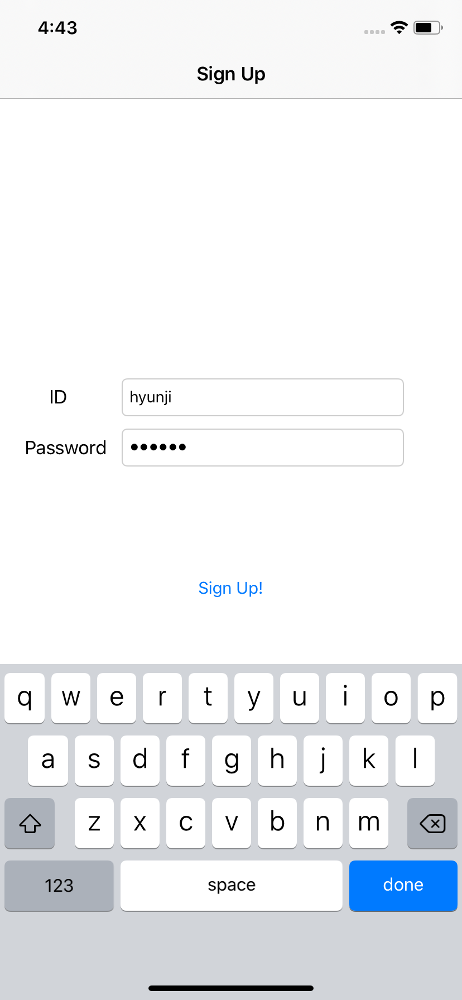</img>
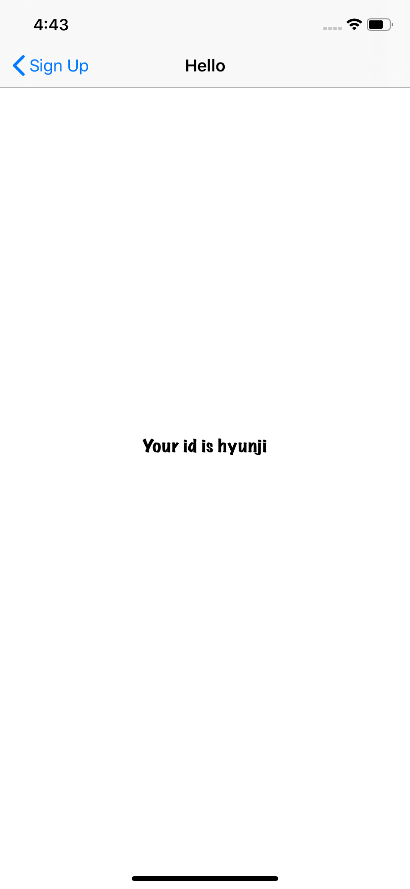</img>

- Keyboard

  ```swift
  // delegate 처리를 위해 UITextFieldDelegate 추가
  class signUpVC: UIViewController, UITextFieldDelegate
  
          // 키보드 done을 누르면 다음 텍스트 필드로 키보드 내려가게 하기
      func textFieldShouldReturn(_ textField: UITextField) -> Bool {
          
          if textField == self.userId {
              
              textField.resignFirstResponder()
              
              self.loginPassword.becomeFirstResponder()
          }
          
          textField.resignFirstResponder()
          
          return true
      }
  ```
  
  # 2_Week
  ### Background Control Button (buttonBackground)
  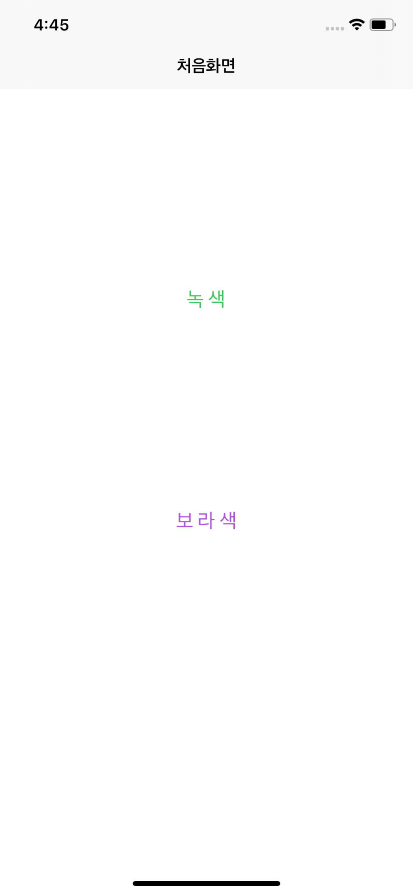</img>
  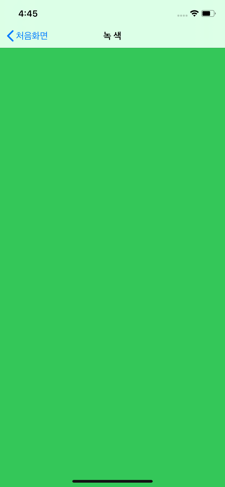</img>
  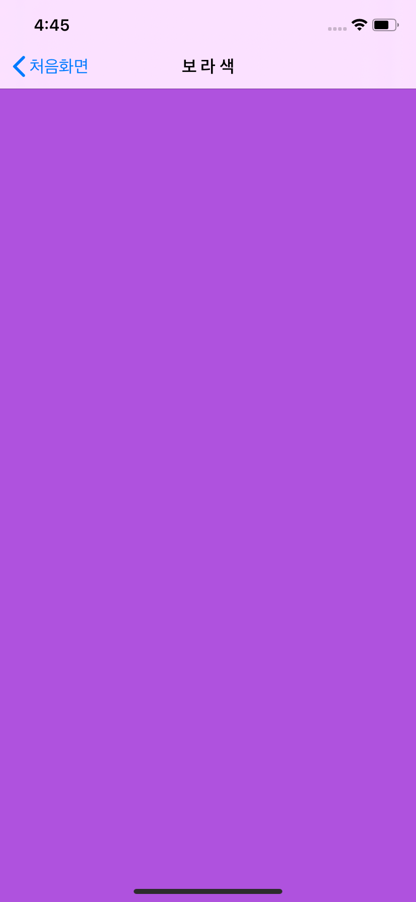</img>
  
  - Button Control
  
  ```swift
  override func prepare(for segue: UIStoryboardSegue, sender: Any?) {
      // segue 별로 이름을 지정할 수 있음
      // 여러 개의 segue 중 어떤 segue가 선택 되었는 지에 따라
      // 적절한 작업을 수행할 수 있도록 함
      
      let destination = segue.destination
      let button = sender as! UIButton
      
      // 버튼 텍스트와 동일한 텍스트를 결과 view에 title로 지정
      destination.title = button.titleLabel?.text
      
      // 버튼 색상과 동일한 색을 배경으로 지정
      destination.view.backgroundColor = button.titleColor(for: .normal)
  }
  ```
  
  # 2_Advanced
  ### Calculator Example (CustomCalculator)
  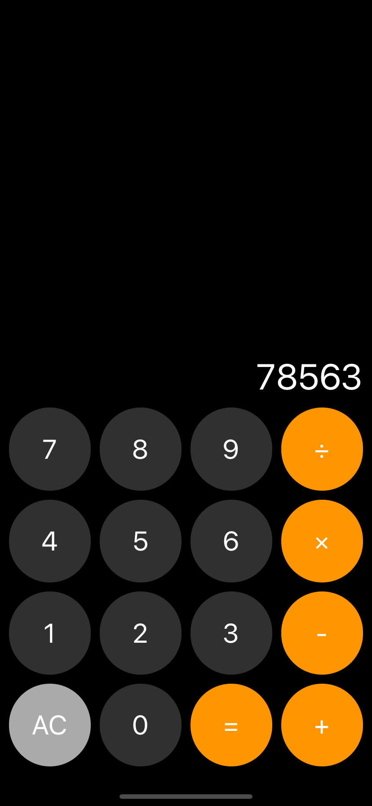</img>
  
  - Custom Button
  
  ```swift
   class RoundButton: UIButton {
       required init(coder aDecoder: NSCoder){
           super.init(coder: aDecoder)!
           self.layer.cornerRadius = self.bounds.size.width * 0.5
       }
   }
  ```

    - Button Control

    ```swift
     @IBAction func touchDigit(_ sender: UIButton) {
         let digit = sender.currentTitle!
         if userIsInTheMiddleOfTyping {
             let textCurrentlyInDisplay = display.text!
             display.text = textCurrentlyInDisplay + digit
         } else {
             display!.text = digit
         }
         userIsInTheMiddleOfTyping = true
     }
    ```
  
  ### 2_Assignment (loginStack)
  
  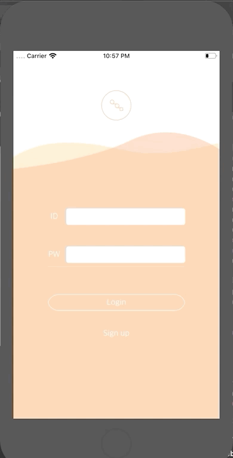 

  
  # 7_Advanced
  
  ### TableView (TableViewEx)
  
    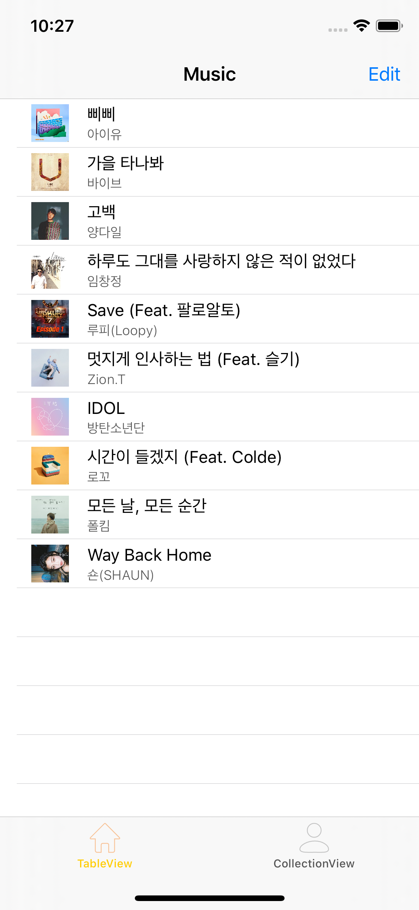</img>
    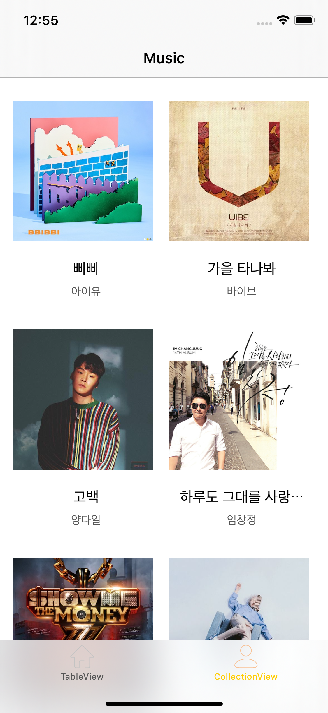</img>


# 7_Seminar

### Social Login - Facebook (SocialLogin)

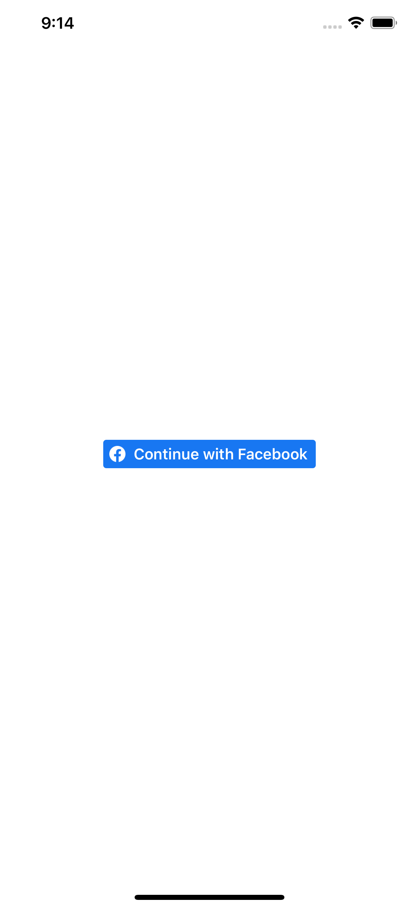</img>
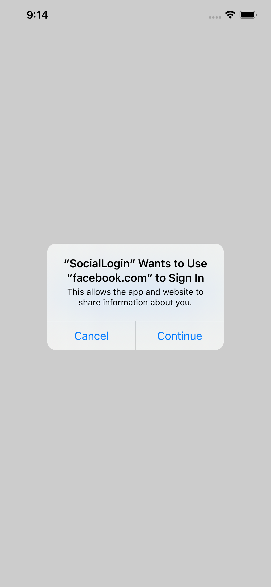</img>
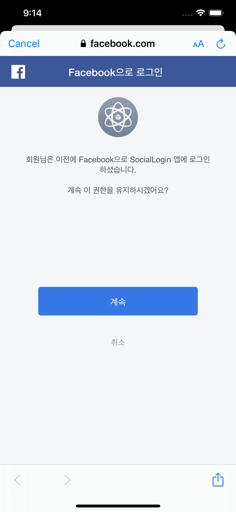</img>
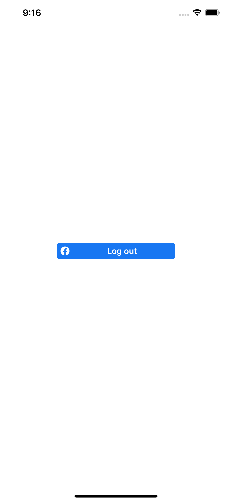</img>
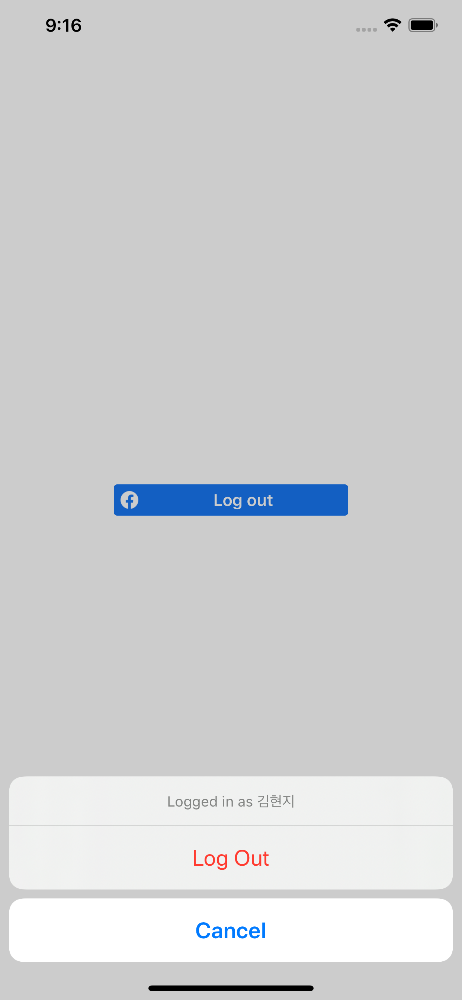</img>

### Social Login - Kakao (SocialLogin)
